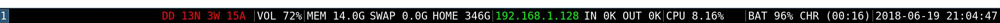

# i3status-datadog
Command for i3status that shows datadog's monitors in warning, alert or nodata



## How to install i3status-datadog

### 1. Build the application
First of all, you will need to build the project. For this, just execute:

```
go build i3status-datadog.go
```

Then, place the executable in a directory accesible by PATH, for example:

```
#> sudo cp i3status-datadog /usr/local/bin/i3status-datadog
```

### 2. Install i3block
Find the easiest way to install the package in your distro. For ubuntu for example, you can just run:

```
#> sudo apt-get install i3blocks
```

### 3. Set i3blocks as your prefered i3bar
You need to edit your i3 configuration file (for example, ~/.config/i3/config), find the "bar" section and set:

```
bar {
        status_command i3blocks
        tray_output primary
}
```
### 4. Add i3status-datadog in your i3blocks configuration
In ubuntu for example, you will find this file on /etc/i3blocks.conf. You could also start i3block on the previous step with -c parameter for specify the configuration file.

You need to add the next configuration:
```
[datadog]
label=DD
interval=60
command=i3status-datadog -apiKey <yourApiKey> -appKey <yourAppKey>
```
### 5. Profit!
